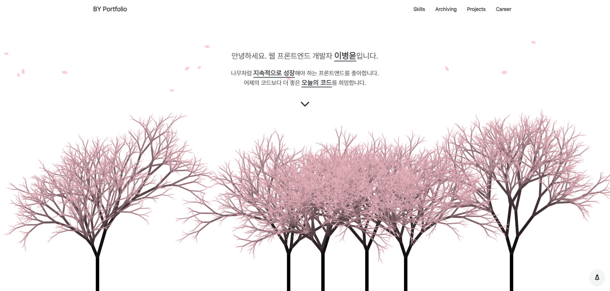

## 나만의 포토폴리오
> Next로 제작한 봄의 테마를 가진 나만의 포토폴리오



- 베포 URL: https://sss-portfolio.vercel.app/

### 프로젝트 소개

- 나만의 포토폴리오를 제작을 위해 Next를 사용하여 제작하였습니다.
- 봄의 테마에 맞게 배경으로는 벚꽃이 내리고 나무가 물든 header를 제작하였습니다.
- 나무의 색깔과 리셋을 할 수 있으며, Skills, Archiving, Projects, Career의 section을 가지고 있습니다.
- Projects의 section에서는 Readme와 사용한 스킬의 경험이 적힌 Skill이 있습니다.

### 개발  환경

- Front: Next.js (14.x), css module
- 배포: vercel
```bash
next: npm run dev
```

### 프로젝트 구조

> App Router

```bash
├── public
│   └── font, img, svg ...
├── app
│   ├── (sakura)
│   │   ├── @modal
│   │   │   └── (.)i
│   │   │       └── [project]
│   │   │           ├── readme
│   │   │           └── skill
│   │   ├── _component
│   │   └── i
│   │       ├── readme
│   │       └── skill
│   └── _data
└── next.config.js, .prettierrcs.js, eslintrc.json ...
``` 

### 채택한 개발 및 신경 쓴 부분

#### Next.js

- Next는 14버젼을 활용하였고 App Router를 기반으로 폴더를 구성하였습니다.
- Next 가이드문서에서 소개되고 있는 Router들을 최대한 활용하면서 프로젝트를 구성하였습니다.
  > - <b>Route Groups</b>을 활용해서 layout을 통일시켰습니다.
  > - [project]는 <b>Dynamic Routes</b>를 활용해서 동적으로 변화하는 project을 대처하였습니다.
  > - @modal <b>Parallel Routes</b>를 활용하여서 동시에 출력되는 컴포넌트 모달, 메시지를 대처하였습니다.
  > - (.)i는 <b>Interceptiong Routes</b>를 활용하여서 Parallel Routes시 매칭되는 폴더구조를 다 구성할 필요가 없이 활용할 수 있도록 사용했습니다.
- 클라이언트 컴포넌트와 서버 컴포넌트의 구분을 명확히 하려고 노력했습니다.
  > - 서버 컴포넌트에 대해서는 캐싱이 되기 때문에 page 파일에 대해서는 서버 컴포넌트로 구성을 하였고, 서버 컴포넌트에서 활용되는 action에 대해서 컴포넌트 분리하여 클라이언트 컴포넌트로 활용하였습니다.
- 폴더 구조에 대해서는 공통적으로 사용하는 컴포넌트에 대해서 _component로 해당하는 디렉토리에 배치하였고, json 데이터는 _data에 배치하였습니다.

#### css module

- 간단하고 많은 컴포넌트들이 사용되지 않는 프로젝트로 판단하여 css module을 사용하였습니다.
- globals.css에 var을 사용하여서 테마를 통일하려고 노력했습니다.
- 사용자 경험을 위해 애니메이션을 부드럽게 하고 UI를 깔끔하게 하려고 노력했습니다.

### 후기

나만의 포토폴리오를 완성하고 나서 든 생각은 이번에 만든것이 봄 테마이기 때문에 여름, 가을, 겨울 테마도 이어서 만들고 싶다라는 생각을 가지게 되었습니다. 그렇기 때문에 route group을 이용하여서 전체적인 route를 구분시켜 두었습니다.
또한 완성된 포토폴리오를 지속적으로 관리하여서 나에게 최대한의 피드백을 계속적으로 줄 것 입니다.